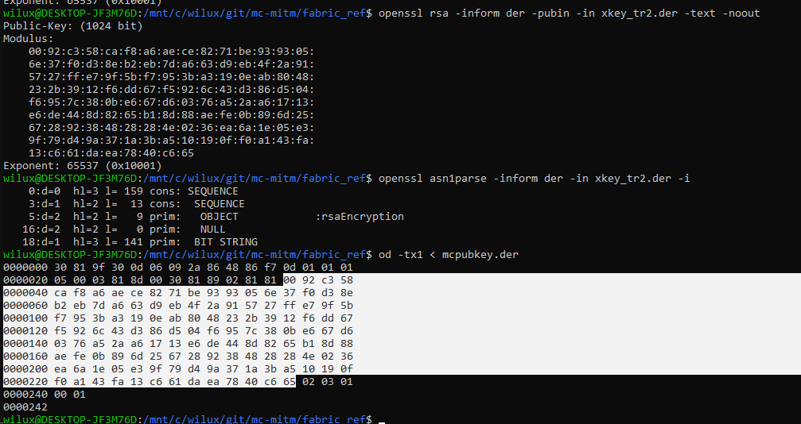

| Mojauth || Client || Proxy || Server | Mojauth |
|---|---|---|---|---|---|---|---|
|||`LoginHelloC2S` | $\rarr$ | not relevant

# Login Start (C→P) `LoginHelloC2S`
| Packet Id | Field Name | Field Type | Value
|---|---|---|---|
|0x00 | Name
|| UUID

# Encryption Request (S→P) `LoginHelloS2C`
| Packet Id | Field Name | Field Type | Value | Notes
|---|---|---|---|---|
|0x01 | Server Id | String (20) | `""` | max 20 java chars bytes *bruuuuuh*
|| Public Key Length | VarInt | `_` |
|| Public Key DER    | VarInt | ~`{KEY: 0x..7BFE}` | 1024 bits rsa = 128 bytes
|| Nonce Length | VarInt | `_` |
|| Nonce        | VarInt | `_` | 16 bytes?

### Encryption Request (P→C) `LoginHelloS2C`
| Packet Id | Field Name | Field Type | Value | Notes
|---|---|---|---|---|
|0x01 | Server Id | String (20) | `0x..7BF` | max 20 java chars bytes *bruuuuuh*
|| Public Key Length | VarInt | `_` |
|| Public Key DER    | VarInt | ~`{KEY: 0xE}` | 1024 bits rsa = 128 bytes
|| Nonce Length | VarInt | `_` |
|| Nonce        | VarInt | `0x..7bfe` | 16 bytes?

noo
`hash(baseServerId.getBytes("ISO_8859_1"), secretKey.getEncoded(), publicKey.getEncoded())`

##
$= SID_{Client}$: ` fakeA ++ ss ++ (fakeB ++ pubkey ++ fakeC)`
$= SID_{Server}$: `[] ++ (fakeD ++ ss ++ fakeE) ++ pubkey`

|| Packet Id | Type | MITM Requirements
|-|---|---|---|
A|`pubkey`                     | X509 RSA pubkey encoding
B|`(fakeB ++ pubkey ++ fakeC)` | X509 RSA pubkey encoding | Known Decrypt
C|`ss`                     | X509? AES symmetric key encoding
D|`(fakeD ++ ss ++ fakeE)` | X509? AES symmetric key encoding | Known Decrypt

- `A` Server picks pubkey, *constant?* $S_{pk}$
- `B` Proxy must find a long ass RSA pubkey $P_{pk}$
    - Massive n and then pick exponent = 1?
    - `B2` Proxy picks a at most 20 character UTF_8 string $P_{name}$
- `C` Client picks a RANDOM symmetric AES key $C_{ss}$ and sends $Enc(C_{ss}, P_{pk})$
- `D` Proxy must find a long ass AES key encoding $P_{ss}$ such that: 
    - $P_{name}++C_{ss}++P_{pk}
    = P_{ss} ++ S_{pk}$

⇒ $P_{pk}$ must end with $S_{pk}$
⇒ $P_{ss}$ must start with $P_{name} ++ C_{ss}$

⇒ $P_{pk} = X ++ S_{pk}$
⇒ $P_{ss} = P_{name} ++ C_{ss} ++ X$

⇒ $P_{name}$ and $X$ must be picked before knowing $C_{ss}$

- $P_{name}$ Encoding should say:
    - i am a valid UTF-8 string
    - i am a valid AES encoding header
    - the next 162 upcoming bytes coming don't matter *(size of X509 encoded 1024 bit RSA)*
    - all the bytes after that do matter
- $X$ should say:
    - i a valid RSA encoding header
    - i (or $S_{pk}$) describe a bad and easy RSA exponent
        - S_{pk} always ends in `0x02 03 01 00 01`
    - i am an AES encoding footer
    - i describe an reversable AES symmetrickey

- $X$ and $P_{name}$ needs to work for ANY $C_{ss}$ and $S_{pk}$

| $X$ | $P_{name}$  |
|-|-|
|RSA header         | AES header
|Very long modulus  |
|                   |

Can end of $S_{pk}$ be interpreted as exponent = 1 by fucking around with the header? if so we are golden!

